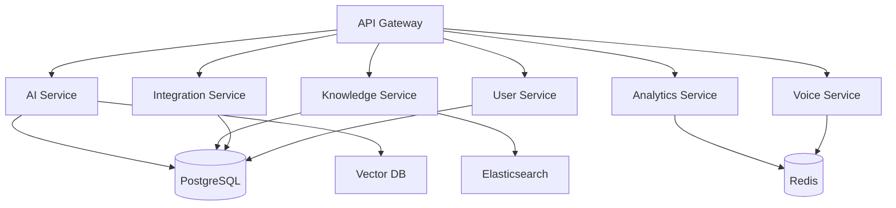

# 🤖 AI-Powered Personal Assistant Platform

<div align="center">


**Nền tảng AI Assistant toàn diện cho doanh nghiệp với kiến trúc microservices**

[📖 Documentation](#documentation) • [🚀 Quick Start](#quick-start) • [🏗️ Architecture](#architecture) • [🤝 Contributing](#contributing)

</div>

---

## 📋 Tổng quan

AI-Powered Personal Assistant Platform là một hệ thống trí tuệ nhân tạo tiên tiến được thiết kế để hỗ trợ các doanh nghiệp tối ưu hóa quy trình làm việc, nâng cao năng suất và cải thiện trải nghiệm người dùng thông qua việc tự động hóa các tác vụ hàng ngày.

### ✨ Tính năng chính

- 🧠 **AI-Powered Conversations** - Hỗ trợ tương tác thông minh với LangChain & RAG
- 📄 **Document Processing** - Phân tích và tóm tắt tài liệu tự động
- 🔗 **Enterprise Integration** - Tích hợp với Slack, Teams, Gmail, Calendar
- 📊 **Analytics Dashboard** - Theo dõi hiệu suất và metrics chi tiết
- 🎙️ **Voice Processing** - Xử lý giọng nói và chuyển đổi văn bản
- 👥 **Team Collaboration** - Quản lý nhóm và quyền hạn

## 🏗️ Kiến trúc

### Microservices Architecture



### 🎯 Services Overview

| Service | Chức năng | Tech Stack |
|---------|-----------|------------|
| **API Gateway** | Central routing, load balancing | NestJS, Kong/Traefik |
| **AI Service** | LangChain, RAG pipeline, AI models | NestJS, LangChain, OpenAI |
| **Knowledge Service** | Document processing, search | NestJS, Elasticsearch |
| **Integration Service** | Third-party integrations | NestJS, OAuth 2.0 |
| **Analytics Service** | Metrics, reporting | NestJS, Time-series DB |
| **Voice Service** | Speech processing | NestJS, FFmpeg |
| **User Service** | Authentication, authorization | NestJS, JWT |

## 🛠️ Tech Stack

### Backend
- **Framework**: NestJS + TypeScript
- **AI/ML**: LangChain, OpenAI API, Hugging Face
- **Databases**: PostgreSQL, Redis, Vector DB (Pinecone/Weaviate)
- **Search**: Elasticsearch
- **Message Queue**: RabbitMQ, Apache Kafka

### Frontend
- **Web**: React 18 + Next.js + TailwindCSS
- **Mobile**: React Native
- **State Management**: Zustand + React Query

### DevOps & Infrastructure
- **Containerization**: Docker + Docker Compose
- **Orchestration**: Kubernetes + Helm
- **CI/CD**: GitHub Actions
- **Monitoring**: Prometheus + Grafana + ELK Stack
- **Package Manager**: PNPM (Strict mode)

## 🚀 Quick Start

### Prerequisites

- **Node.js** >= 20.0.0
- **PNPM** >= 8.0.0
- **Docker** & Docker Compose
- **Git**

### Installation

```bash
# Clone repository
git clone https://github.com/plap9/saas.git
cd ai-assistant-platform

# Install dependencies (STRICT MODE - NEVER modify package versions)
pnpm install --frozen-lockfile

# Verify installation
pnpm list --depth=0

# Security audit
pnpm audit --audit-level moderate
```

### Development Setup

```bash
# Start development environment
docker-compose -f docker-compose.dev.yml up -d

# Run database migrations
pnpm migration:run

# Start all services in development mode
pnpm dev

# Or start specific service
pnpm --filter ai-service start:dev
```

### Production Deployment

```bash
# Build all services
pnpm build:all

# Build Docker images
docker-compose -f docker-compose.prod.yml build

# Deploy to production
docker-compose -f docker-compose.prod.yml up -d

# Health check
pnpm test:health --env=production
```

## 📁 Project Structure

```
ai-assistant-platform/
├── apps/                     # Microservices
│   ├── api-gateway/         # Central routing service
│   ├── ai-service/          # AI & LangChain service
│   ├── knowledge-service/   # Document processing
│   ├── integration-service/ # Third-party integrations
│   ├── analytics-service/   # Metrics & analytics
│   ├── voice-service/       # Speech processing
│   └── user-service/        # User management
├── libs/                    # Shared libraries
│   ├── common/             # Common utilities
│   ├── database/           # Database configs
│   ├── langchain/          # AI configurations
│   └── types/              # TypeScript types
├── frontend/               # Frontend applications
│   ├── dashboard/          # Admin dashboard
│   ├── widget/             # Embeddable widget
│   └── mobile/             # Mobile app
├── infrastructure/         # DevOps configurations
│   ├── docker/             # Docker configurations
│   ├── kubernetes/         # K8s manifests
│   ├── terraform/          # Infrastructure as Code
│   └── monitoring/         # Monitoring configs
├── docs/                   # Documentation
└── scripts/                # Utility scripts
```

## 🧪 Testing

```bash
# Run all tests
pnpm test:all

# Unit tests
pnpm test

# Integration tests
pnpm test:integration

# E2E tests
pnpm test:e2e

# Test coverage
pnpm test:cov

# Performance tests
pnpm test:performance
```

## 📊 API Documentation

- **Staging**: https://api-staging.aiassistant.com/docs
- **Production**: https://api.aiassistant.com/docs

### API Versioning
```
GET /api/v1/ai/conversations     # V1 API
GET /api/v2/ai/conversations     # V2 API with enhanced features
```

## 🔧 Development Commands

### Package Management (PNPM Strict Mode)
```bash
# ✅ ALLOWED - Safe commands
pnpm install --frozen-lockfile    # Install exact dependencies
pnpm list --depth=0               # List workspace packages
pnpm audit --audit-level moderate # Security audit (view only)

# ❌ FORBIDDEN - Auto-modification commands
pnpm install                      # May update lockfile
pnpm update                       # Auto update packages
pnpm add <package>               # Add new packages during setup
```

### Build Commands
```bash
pnpm build:all                   # Build all packages
pnpm --filter ai-service build   # Build specific service
pnpm -r --parallel build         # Parallel build
```

### Service Management
```bash
pnpm dev                         # Start all services
pnpm --filter api-gateway start:dev  # Start specific service
pnpm lint                        # Lint all packages
pnpm format                      # Format code
```

## 🐳 Docker Commands

```bash
# Development
docker-compose -f docker-compose.dev.yml up -d

# Production
docker-compose -f docker-compose.prod.yml up -d

# Build specific service
docker build -f apps/ai-service/Dockerfile -t ai-service .

# View logs
docker-compose logs -f ai-service
```

## 🔒 Security

### Environment Variables
```bash
# Copy and configure environment files
cp .env.example .env.local
cp .env.example .env.production
```

### Required Environment Variables
- `DATABASE_URL` - PostgreSQL connection string
- `REDIS_URL` - Redis connection string  
- `OPENAI_API_KEY` - OpenAI API key
- `PINECONE_API_KEY` - Pinecone vector database key
- `JWT_SECRET` - JWT signing secret

## 📈 Monitoring

### Health Checks
```bash
# Service health
curl http://localhost:3000/health

# Database health  
curl http://localhost:3000/health/db

# AI service health
curl http://localhost:3001/health/ai
```

### Metrics Endpoints
- **Prometheus**: http://localhost:9090
- **Grafana**: http://localhost:3004
- **Kibana**: http://localhost:5601

## 🤝 Contributing

### Development Workflow

1. **Task Management**: Luôn tạo Plan (.cursor/plans/) và Task (.cursor/tasks/) trước khi bắt đầu
2. **Branch Naming**: `feature/YYYYMMDD-task-name`
3. **Commit Convention**: 
   ```
   feat(ai-service): add RAG chain implementation
   fix(user-service): resolve authentication bug
   docs(readme): update installation instructions
   ```

### Code Standards
- **TypeScript strict mode** cho tất cả services
- **NestJS architecture patterns**
- **PNPM strict dependency management**
- **Comprehensive error handling**
- **Unit + Integration testing**

### Pull Request Process
1. Create feature branch
2. Implement changes following our coding standards
3. Add/update tests
4. Update documentation
5. Submit PR with detailed description

## 📚 Documentation

- **Architecture Guide**: [docs/architecture.md](docs/architecture.md)
- **API Reference**: [docs/api.md](docs/api.md)
- **Development Guide**: [docs/development.md](docs/development.md)
- **Deployment Guide**: [docs/deployment.md](docs/deployment.md)

## 🎯 Roadmap

### Phase 1: MVP (Q1 2025)
- ✅ Core microservices architecture
- ✅ Basic AI service with LangChain
- 🚧 Integration service
- 🚧 Web dashboard

### Phase 2: Advanced Features (Q2 2025)
- 📝 Advanced AI capabilities
- 📝 Mobile applications
- 📝 Enterprise integrations
- 📝 Advanced analytics

### Phase 3: Scale & Optimize (Q3 2025)
- 📝 Performance optimization
- 📝 Advanced security features
- 📝 Multi-language support
- 📝 Enterprise marketplace

## 📄 License

This project is licensed under the MIT License - see the [LICENSE](LICENSE) file for details.

## 👥 Team

- **Architecture**: Microservices + AI/ML Engineering
- **Backend**: NestJS + TypeScript Development
- **Frontend**: React + Mobile Development  
- **DevOps**: Kubernetes + CI/CD Engineering
- **AI/ML**: LangChain + Model Engineering

## 🆘 Support

- **Documentation**: [docs/](docs/)
- **Issues**: [GitHub Issues](https://github.com/plap9/saas/issues)
- **Discussions**: [GitHub Discussions](https://github.com/plap9/saas/discussions)
- **Email**: support@aiassistant.com

---

<div align="center">

**[⬆ Back to top](#-ai-powered-personal-assistant-platform)**

Made with ❤️ by the plap09

</div>
